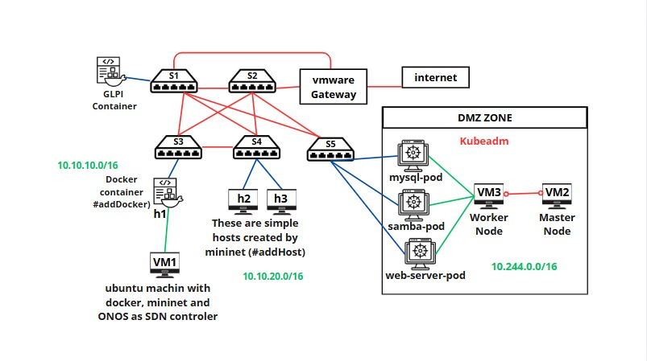

# 📘 SDN Project with Containernet, ONOS, Kubernetes & GLPI

## 🧠 Introduction

This project provides a comprehensive, hands-on implementation of **Software-Defined Networking (SDN)** using a hybrid infrastructure that combines **Containernet**, **ONOS controller**, **Kubernetes**, **Docker**, and **GLPI**. It demonstrates how SDN can simplify and enhance network management by decoupling the control plane from the data plane, allowing for centralized and programmable network control.

In this environment:

* **ONOS** serves as the SDN controller.
* **Containernet** is used for network emulation.
* **Kubernetes** orchestrates service deployment.
* **GLPI** manages IT assets.

This setup is ideal for **IT students**, **network engineers**, and **educators** seeking a simulated yet realistic lab environment.

---

## 🗺️ Project Topology



The infrastructure consists of **three Virtual Machines (VMs)**:

| VM    | Role                                        | IP Address          |
| ----- | ------------------------------------------- | ------------------- |
| `vm1` | Linux VM (Docker, ONOS, Containernet, GLPI) | `192.168.100.30/24` |
| `vm2` | Kubernetes Master Node                      | `192.168.100.31/24` |
| `vm3` | Kubernetes Worker Node                      | `192.168.100.32/24` |

---

## ⚙️ Step 1: Setup `vm1` (Linux Base)

### ✅ Update System Packages

We will use the first vm (vm1) for hosting the sdn network emulator Containernet, the sdn controller Onos and GLPI.
For this we have to install Docker. But first lets update the base system to ensure all packages are up to date.

```bash
sudo apt update && sudo apt upgrade -y
```

We are going to clone this repositry also because it contains the necessary files for this project.
### 🔁 Clone the Repository

Get the project files from GitHub:

```bash
git clone https://github.com/younessoub/projet_M207.git
cd projet_M207
```

### 🐳 Install Docker

Follow the official Docker installation instructions:
👉 [Install Docker on Ubuntu](https://docs.docker.com/engine/install/ubuntu/)

### 📦 Pull Required Docker Images

Pull necessary images for ONOS and Containernet:

```bash
sudo docker pull onosproject/onos
sudo docker pull containernet/containernet:v1
```

### 🛠️ Build Custom Gateway Image

Build a custom Docker image for the network gateway (defined in the Dockerfile):

```bash
sudo docker build -t gateway .
```

---

## ☸️ Step 2: Setup Kubernetes (`vm2` + `vm3`)

### 🔧 Install Kubeadm on Both VMs

Install Kubernetes components (`kubeadm`, `kubelet`, `kubectl`) using either the included `kubeadm_install.txt` guide or:
👉 [Official Kubeadm Installation Guide](https://kubernetes.io/docs/setup/production-environment/tools/kubeadm/install-kubeadm/)

* `vm2`: will be initialized as the **master node**.
* `vm3`: will join as a **worker node**.

---

## 🚀 Step 3: Deploy Services on Kubernetes

On the **master node (vm2)**, apply the YAML service manifests provided in the repository:

```bash
kubectl apply -f http.yaml
kubectl apply -f mysql.yaml
kubectl apply -f samba.yaml
```

### 🔍 Verify Deployment

Check if services are running:

```bash
kubectl get svc
```

---

## 🧩 Step 4: Launch ONOS and Other Docker Services on `vm1`

Use Docker Compose to start services defined in `docker-compose.yml`:

```bash
sudo docker compose up -d
```

---

## 🌐 Step 5: Access ONOS Web UI

Open your browser and navigate to:

```
http://192.168.100.30:8181/onos/ui/
```

**Login credentials:**

* Username: `onos`
* Password: `rocks`

---

## ⚙️ Step 6: Activate ONOS Core Applications

From the ONOS Web UI, go to **Main Menu → Applications** and activate:

* `org.onosproject.openflow-base` (OpenFlow Base Provider)
* `org.onosproject.proxyarp` (Proxy ARP/NDP)
* `org.onosproject.lldpprovider` (LLDP Link Provider)
* `org.onosproject.hostprovider` (Host Location Provider)
* `org.onosproject.fwd` (Reactive Forwarding)
* `org.onosproject.acl` (Access Control Lists)

These applications enable traffic discovery, host tracking, link detection, and ACL enforcement.

---

## 🏗️ Step 7: Use Containernet for Network Topology

On `vm1`, access the Containernet container:

```bash
sudo docker exec -it containernet bash
```

Install a text editor:

```bash
apt install nano
```

Create or modify your topology file:

```bash
nano mytopo.py
```

Paste your custom topology from the repository and run:

```bash
mn -c
mn --custom mytopo.py
```

---

## 🧰 Step 8: Deploy GLPI IT Management Tool

On `vm1`, move to the GLPI directory and use Docker Compose:

```bash
cd glpi
sudo docker compose up -d
```

This brings up GLPI as a web-accessible containerized service for managing IT inventory.

---

## 🔐 Step 9: Configure ONOS ACL Rules

Use ONOS's REST API to enforce access policies.
Replace `<vm1-ip-address>` and `<your-vm-lan-network-address>` with appropriate values:

```bash
# Allow internal subnet communication
curl -u onos:rocks -X POST -H "Content-Type: application/json" -d '{
  "srcIp": "10.10.0.0/16",
  "dstIp": "10.10.0.0/16",
  "action": "ALLOW"
}' http://<vm1-ip-address>:8181/onos/v1/acl/rules

# Allow access to LAN
curl -u onos:rocks -X POST -H "Content-Type: application/json" -d '{
  "srcIp": "10.10.0.0/16",
  "dstIp": "<your-vm-lan-network-address>/16",
  "action": "ALLOW"
}' http://<vm1-ip-address>:8181/onos/v1/acl/rules

# Deny internet access
curl -u onos:rocks -X POST -H "Content-Type: application/json" -d '{
  "srcIp": "10.10.0.0/16",
  "action": "DENY"
}' http://<vm1-ip-address>:8181/onos/v1/acl/rules
```

These rules restrict external internet access while allowing internal and LAN communication.

---

## 🗃️ Step 10: Create Databases in MySQL (Kubernetes Service)

Connect to the MySQL service running in the Kubernetes cluster from `vm2`:

```bash
mysql -h <master-node-ip> -P <service-port> -u root -p
```

Password: `rootpass` (defined in `mysql.yaml`)

### 🔧 Create Databases

```sql
CREATE DATABASE db1;
CREATE DATABASE db2;
```

### 👤 Create Users

```sql
CREATE USER 'user1'@'%' IDENTIFIED BY 'password1';
CREATE USER 'user2'@'%' IDENTIFIED BY 'password2';
CREATE USER 'user3'@'%' IDENTIFIED BY 'password3';
```

### 🔐 Grant Privileges

```sql
GRANT ALL PRIVILEGES ON db1.* TO 'user1'@'%';
GRANT ALL PRIVILEGES ON db2.* TO 'user2'@'%';
GRANT ALL PRIVILEGES ON db2.* TO 'user3'@'%';
FLUSH PRIVILEGES;
```

---

## ✅ Final Checklist & Tips

* Ensure all VMs can communicate over the same network.
* Use `kubectl get nodes` to verify Kubernetes cluster status.
* Use `docker ps` on `vm1` to confirm running containers.
* Restart any service using `docker restart <container_id>` or `kubectl rollout restart` if needed.
* Make backups of important YAML and configuration files.

---

## 📚 Resources

* [ONOS Documentation](https://wiki.onosproject.org/)
* [Containernet GitHub](https://github.com/containernet/containernet)
* [Kubernetes Docs](https://kubernetes.io/docs/)
* [GLPI Project](https://glpi-project.org/)

---
