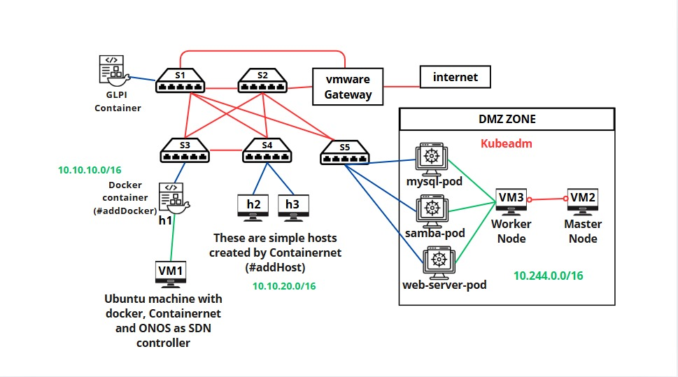
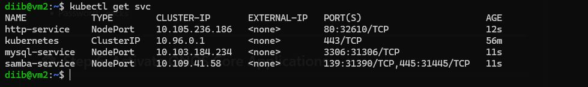
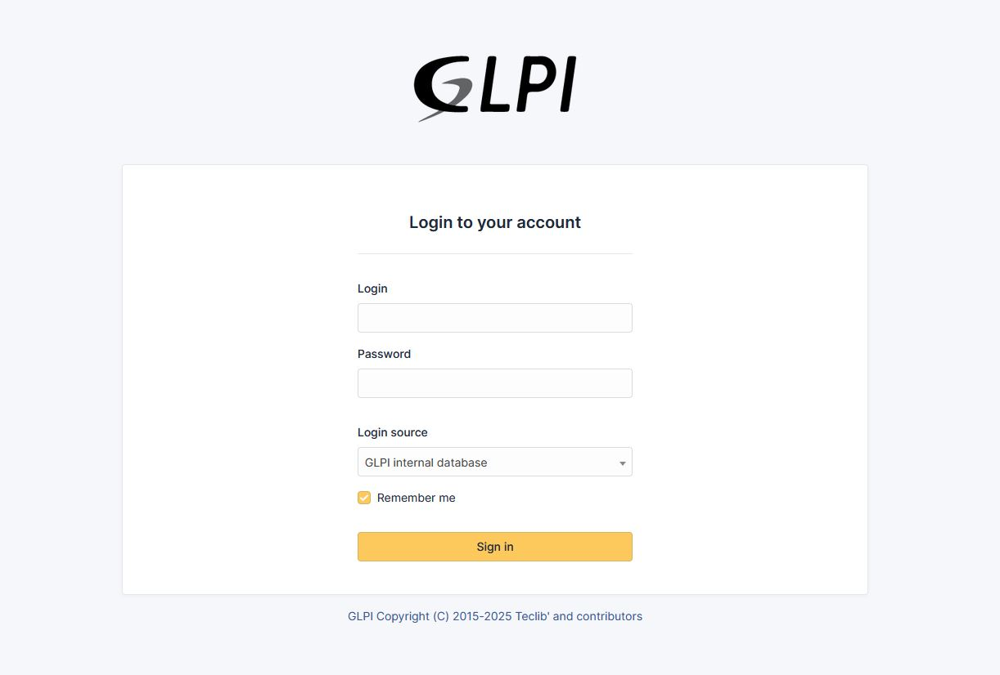
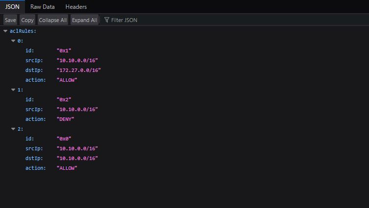
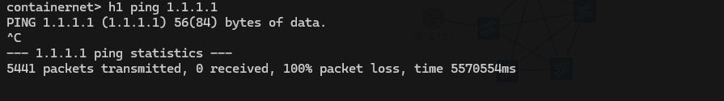

# 📘 SDN Project with Containernet, ONOS, Kubernetes & GLPI

## 🧠 Introduction

This project provides a comprehensive, hands-on implementation of **Software-Defined Networking (SDN)** using a hybrid infrastructure that combines **Containernet**, **ONOS controller**, **Kubernetes**, **Docker**, and **GLPI**. It demonstrates how SDN can simplify and enhance network management by decoupling the control plane from the data plane, allowing for centralized and programmable network control.

In this environment:

* **ONOS** serves as the SDN controller.
* **Containernet** is used for network emulation.
* **Kubernetes** orchestrates service deployment.
* **GLPI** manages IT assets.

This setup is ideal for **IT students**, **network engineers**, and **educators** seeking a simulated yet realistic lab environment.

---

## 🗺️ Project Topology



The infrastructure consists of **three Virtual Machines (VMs)**:

| VM    | Role                                        | IP Address          |
| ----- | ------------------------------------------- | ------------------- |
| `vm1` | Linux VM (Docker, ONOS, Containernet, GLPI) | `192.168.100.30/24` |
| `vm2` | Kubernetes Master Node                      | `192.168.100.31/24` |
| `vm3` | Kubernetes Worker Node                      | `192.168.100.32/24` |

---

## ⚙️ Step 1: Setup `vm1` (Linux Base)

### ✅ Update System Packages

We will use the first vm (vm1) for hosting the sdn network emulator Containernet, the sdn controller Onos and GLPI.
For this we have to install Docker. But first lets update the base system to ensure all packages are up to date.

```bash
sudo apt update && sudo apt upgrade -y
```

We are going to clone this repositry also because it contains the necessary files for this project.
### 🔁 Clone the Repository

Get the project files from GitHub:

```bash
git clone https://github.com/younessoub/projet_M207.git
```

### 🐳 Install Docker

Follow the official Docker installation instructions, make sure that you follow the instructions for YOUR linux distro:
👉 [Install Docker on Ubuntu](https://docs.docker.com/engine/install/ubuntu/)

### 📦 Pull Required Docker Images

Pull necessary images for ONOS and Containernet:

```bash
sudo docker pull onosproject/onos
sudo docker pull containernet/containernet:v1
```

### 🛠️ Build Custom Gateway Image

Build a custom Docker image that will serve as a gateway for our network using the Dockerfile in the repositry. 
Before running this command make sure to cd into the repositry folder:
```
cd projet_M207
```


```bash
sudo docker build -t gateway .
```

---

## ☸️ Step 2: Setup Kubernetes (`vm2` + `vm3`)

### 🔧 Install Kubeadm on Both VMs 

* `vm2`: will be initialized as the **master node**.
* `vm3`: will join as a **worker node**.

Install Kubernetes components (`kubeadm`, `kubelet`, `kubectl`) using the [official guide](https://kubernetes.io/docs/setup/production-environment/tools/kubeadm/install-kubeadm)
,Or you can use the following Instructions:

### For the Master Node and The worker node:

Run these commands in both the master node (vm2) and the worker node (vm3):

```
sudo swapoff -a
```
```
sudo nano /etc/fstab
```
comment swap line in /etc/fstab


Install [Docker engine](https://docs.docker.com/engine/install/ubuntu/)

```
sudo chmod 646 /etc/containerd/config.toml
```

```
containerd config default > /etc/containerd/config.toml
```

```
sudo nano /etc/containerd/config.toml
```
change "SystemdCgroup = false" to "SystemdCgroup = true"


change "sandbox_image = "registry.k8s.io/pause:3.8" to "sandbox_image = "registry.k8s.io/pause:3.10"


save the file and exit


```
sudo systemctl restart containerd
```

```
sudo apt-get update
```

```
sudo apt-get install -y apt-transport-https ca-certificates curl gpg
```

```
curl -fsSL https://pkgs.k8s.io/core:/stable:/v1.33/deb/Release.key | sudo gpg --dearmor -o /etc/apt/keyrings/kubernetes-apt-keyring.gpg
```

```
echo 'deb [signed-by=/etc/apt/keyrings/kubernetes-apt-keyring.gpg] https://pkgs.k8s.io/core:/stable:/v1.33/deb/ /' | sudo tee /etc/apt/sources.list.d/kubernetes.list
```

```
sudo apt-get update
```

```
sudo apt-get install -y kubelet kubeadm kubectl
```

```
sudo apt-mark hold kubelet kubeadm kubectl
```

```
sudo systemctl enable --now kubelet
```
```
sudo modprobe br_netfilter
```

```
echo "br_netfilter" | sudo tee /etc/modules-load.d/k8s.conf
```

```
cat <<EOF | sudo tee /etc/sysctl.d/k8s.conf
net.bridge.bridge-nf-call-iptables  = 1
net.ipv4.ip_forward                 = 1
net.bridge.bridge-nf-call-ip6tables = 1
EOF
```
```
sudo sysctl --system
```


### 🧠 For the Master node Only:

run these commands in the master node (vm2)

```
kubeadm init --pod-network-cidr=10.244.0.0/16 --apiserver-advertise-address=<master-node-ip>
```
After running this command make sure to copy the kubeadm join line in order to execute it in the worker node


```
mkdir -p $HOME/.kube
```
```
sudo cp -i /etc/kubernetes/admin.conf $HOME/.kube/config
```

```
sudo chown $(id -u):$(id -g) $HOME/.kube/config
```
```
kubectl apply -f https://github.com/flannel-io/flannel/releases/latest/download/kube-flannel.yml
```


### 🛠  For the Worker Node only :

run the "kubeadm join" line you copied earlier


### Check if kubeadm is set successfuly

To check if the kubeadm is running and the worker node has joined run the following command in the master node : 

```
kubectl get nodes
```
You should see something like this :


---


## 🚀 Step 3: Deploy Services on Kubernetes

On the **master node (vm2)**, apply the YAML service manifests provided in the repository:

Create three files: http.yaml, samba.yaml and mysql.yaml 

The contents for the files is provided in the [k8s_services folder](./k8s_services)

After saving them run the following commands

```bash
kubectl apply -f http.yaml
kubectl apply -f mysql.yaml
kubectl apply -f samba.yaml
```

### 🔍 Verify Deployment

Check if services are running:

```bash
kubectl get svc
```

---

## 🧩 Step 4: Launch ONOS and Containernet on `vm1`

Use Docker Compose to start services defined in `docker-compose.yml` in vm1:

```bash
sudo docker compose up -d
```

---

## 🌐 Step 5: Access ONOS Web UI

Open your browser and navigate to:

```
http://< vm1-ip >:8181/onos/ui/
```

**Login credentials:**

* Username: `onos`
* Password: `rocks`

---

## ⚙️ Step 6: Activate ONOS Core Applications

From the ONOS Web UI, go to **Main Menu → Applications** and activate:

* `org.onosproject.openflow-base` (OpenFlow Base Provider)
* `org.onosproject.proxyarp` (Proxy ARP/NDP)
* `org.onosproject.lldpprovider` (LLDP Link Provider)
* `org.onosproject.hostprovider` (Host Location Provider)
* `org.onosproject.fwd` (Reactive Forwarding)
* `org.onosproject.acl` (Access Control Lists)


These applications enable traffic discovery, host tracking, link detection, and ACL enforcement.

---

## 🏗️ Step 7: Use Containernet for Network Topology

On `vm1`, access the Containernet container:

```bash
sudo docker exec -it containernet bash
```

Install nano:

```bash
apt install nano
```

Create your topology file:

```bash
nano mytopo.py
```

Paste the custom [topology file](./mytopo.py) from the repository  and save it and run:

```bash
mn -c
mn --custom mytopo.py
```

in the Containernet CLI run the following command : 

```
pingall
```

if you go back to Onos GUI you should see something like this (click on h to show hosts)


---

## 🧰 Step 8: Deploy GLPI IT Management Tool

On `vm1`, move to the GLPI directory and use Docker Compose:

```bash
cd glpi
sudo docker compose up -d
```

Access GLPI web UI on: 

```
 http://< vm1-ip >:80
```

And follow the steps to install glpi.

For The sql server ip enter the mariadb container ip address

SQL user is glpi_user

and SQL password is glpi


After installing glpi you should see the login page



user : glpi

password : glpi


Lets add a user in glpi by going to Administration > Users :


Fill the user Info : 


Lets login using the newly created user


After login in click on create ticket to create a new ticket


Fill the ticket form info and click submit message


Back in the admin dashboard we can see the new ticket


---

## 🔐 Step 9: Configure ONOS ACL Rules

Use ONOS's REST API to enforce access policies.
Replace `<vm1-ip-address>` and `<your-vm-lan-network-address>` with appropriate values:

```bash
# Allow internal subnet communication
curl -u onos:rocks -X POST -H "Content-Type: application/json" -d '{
  "srcIp": "10.10.0.0/16",
  "dstIp": "10.10.0.0/16",
  "action": "ALLOW"
}' http://<vm1-ip-address>:8181/onos/v1/acl/rules

# Allow access to LAN
curl -u onos:rocks -X POST -H "Content-Type: application/json" -d '{
  "srcIp": "10.10.0.0/16",
  "dstIp": "<your-vm-lan-network-address>/16",
  "action": "ALLOW"
}' http://<vm1-ip-address>:8181/onos/v1/acl/rules

# Deny internet access
curl -u onos:rocks -X POST -H "Content-Type: application/json" -d '{
  "srcIp": "10.10.0.0/16",
  "action": "DENY"
}' http://<vm1-ip-address>:8181/onos/v1/acl/rules
```

These rules restrict external internet access while allowing internal and LAN communication.

Make sure the ACLs are enabled by accessing the following url:

http://< vm1-ip >:8181/onos/v1/acl/rules

Username : onos
password : rocks

You should see something like this:




---

## 🗃️ Step 10: Create Databases in MySQL (Kubernetes Service)

Connect to the MySQL service running in the Kubernetes cluster from `vm2`:

```bash
mysql -h <master-node-ip> -P <service-port> -u root -p
```

Password: `rootpass` (defined in [mysql.yaml](./k8s_services/mysql.yaml) )

### 🔧 Create Databases

```sql
CREATE DATABASE db1;
CREATE DATABASE db2;
```

### 👤 Create Users

```sql
CREATE USER 'user1'@'%' IDENTIFIED BY 'password1';
CREATE USER 'user2'@'%' IDENTIFIED BY 'password2';
CREATE USER 'user3'@'%' IDENTIFIED BY 'password3';
```

### 🔐 Grant Privileges

```sql
GRANT ALL PRIVILEGES ON db1.* TO 'user1'@'%';
GRANT ALL PRIVILEGES ON db2.* TO 'user2'@'%';
GRANT ALL PRIVILEGES ON db2.* TO 'user3'@'%';
FLUSH PRIVILEGES;
```

---

## ✅ Tests

#### To test the connectivity between hosts we use the command "pingall" in Containernet CLI


#### Hosts can access GLPI web  interface on port 80


#### Hosts can access the http service in kubernetes


#### Hosts can access Mysql service in kubernetes


#### Hosts can access Samba service in kubernetes


#### Hosts cannot ping the internet Because ACLs prevent it




---

## 📚 Resources

* [ONOS Documentation](https://wiki.onosproject.org/)
* [Containernet GitHub](https://github.com/containernet/containernet)
* [Kubernetes Docs](https://kubernetes.io/docs/)
* [GLPI Project](https://glpi-project.org/)

---

##  👥 Project authors

OUBELKACEM Youness

TBATOU Abdelmalek

TERICHE yassine

AIT BRAHIM Imad

Darouf Mohammed

Sajid oualid

tahiri abdellah

AIT ABDELLAH Naoufal

Lmslk Mustapha

MAROUA RAMY
